# 我的Unity学习笔记

## 一、素材编辑：

### tips：

​	**1.Hierarchy			---层级**

​		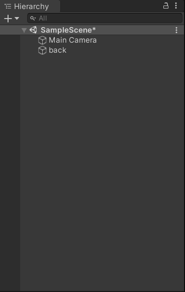

​	**2.打开一幅图片素材**

​	Pixels Per Unit			---每单位像素网格的像素点

​	**默认为 100，用不到那么多，学习项目中改为了 16。**

​	**3.左上角操作图标**

​	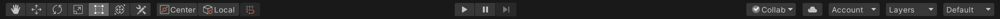

​	从左到右:

​	快捷键是 <kbd>Q</kbd> <kbd>W</kbd> <kbd>E</kbd> <kbd>R</kbd> <kbd>T</kbd> <kbd>Y</kbd> 

​	Hand Tool:	移动你的视角，不移动素材

​	Move Tool:	点击后拖拽移动素材

​	Rotate Tool:

​	Scale Tool:

​	Rect Tool:

​	Move, Rotate or Scale selected objects:

​	**4.Tilemap			---瓦图**

​	 	打开Tile palette			---瓦片调色板

​		新建map文件夹，调整 Sprite Mode 设置为 Multiple，使用 Sprite Editor 中的 Slice 对图片中的		素材切分。

​		Slice： 可以选择切片方式，Automatic为自动切割，但有时候不能达到我们想要的结果，于是我们可以使用 Grid By Cell Size 或者 Grid By Cell Count 来自定义切割

​		Grid By Cell Size：直接设置的像素单元格大小为 16 ，所以这里可以设置切割的Pixel Size 的 XY为16。

​		绘制你的 Tilemap：将切割好的素材图片拖拽到 Tile palette 中，使用笔刷按钮“paint with active brush(B)”,选择你想用的小图片填充到 Scene 中小单元格中。

​	**My result：**

​		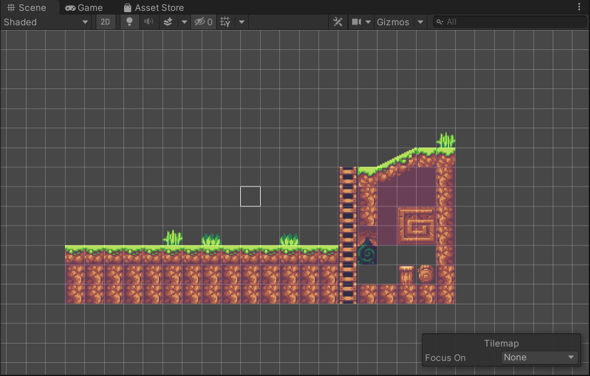

## 二、图层layer & 角色建立

​	**1.Sorting Layer**

​		对于每个 scene 我们要设置它的图层，使得它们的堆叠达到我们想要的结果，比如背景是蔚蓝色的天空，天空前面则是我们的地图。在 Sorting Layer 下拉框中，我们可以自定义添加图层，它的排序规则是，排在越下面的图层类型越会出现在屏幕的前面。即 ：back -->  front。

​		当我们的图形设置在了统一图层，我们可以修改 Order in Layer。数字越大越显示在屏幕前方。

​	**2.Player**

​		如果添加的  Player（拖拽到 sprite） 没有在 Game 里显示，则 Reset。

​		Add Component : 添加组件

​		可以为我们的对象添加各种组件如脚本、渲染效果、物理效果等。

​		在 2D Game 中，常用的组件 Rigidbody 2D (刚体) : 把对象转换成”实际的物体“。

​		Conllider : 碰撞体 

​		Box Conllider 2D ：碰撞箱

​		我们可以为 Player 设置一个碰撞箱，可以使用 Edit Conllider 编辑它的大小。

​		然后将我们的 Tilemap 设置一个 Tilemap Conllider，同样使地图也成为一个碰撞体。

​	**My result:**

​	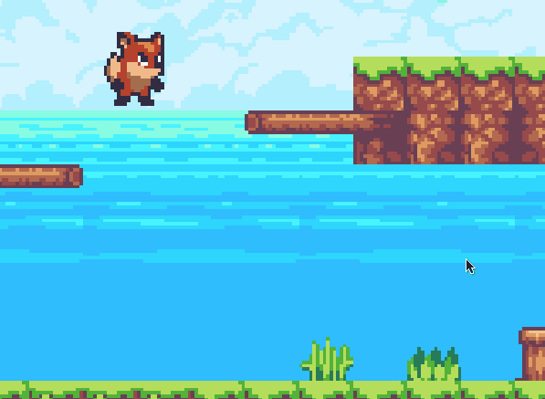

# 三、角色移动 Move

​	**1.输入方向键**

​		Edit --> Project Settings --> Input --> Axes(轴线) --> Horizontal(横向移动)

​		在这里可以自己更改和添加按键

​	**2.添加脚本代码 Script**

​		在 Player 中 Add Component --> new Script,创建后文件在 Assets的根目录下。

​		为了规范化，我们新建文件夹 Scripts，用于存放我们所有的 Script代码。

​		编写代码使用的高级程序语言是C#，使用的IDE可以选择 Visual Studio 或者 Visual Studio Code 等，根据个人习惯，这里我所使用的是 VS Code。二者若需要Unity代码提示等功能都可下载Unity相关扩展插件。

​		<u>如果遇到了 IDE 无法是用代码补全的问题，进入Edit --> Preference --> External Tools --> External Script Editor 设置为你所用的 IDE。</u>

​		如果是新建的一个Unity工程，打开C#脚本后输入关键词发现并没提示或者补全功能，这个问题也好解决，就是**缺少.sln**文件，解决方法如下：

​		**Assets->Open C# Project**，会自动打开VSCode，这时发现工程的根目录已经生成**.sln**文件，这时再输入关键词就有提示和补全功能。（转自简书）

​	**3.编写代码**

​			PlayerController.cs :

```c#
using System.Collections;
using System.Collections.Generic;
using UnityEngine;

public class PlayerController : MonoBehaviour
{
    public Rigidbody2D rb;
    public float speed;

    // Start is called before the first frame update
    void Start()
    {
        
    }

    // Update is called once per frame 每一帧更新
    void Update()
    {
        Movement();
    }

    void Movement()
    {
        float horizontal_move;//用于获取Input的值，-1往左，+1往右
        horizontal_move = Input.GetAxis("Horizontal");

        if (horizontal_move != 0)//如果水平方向值不为 0 
        {
            rb.velocity = new Vector2(horizontal_move * speed, rb.velocity.y);
            //刚体的运动速度 为 2D的向量， x方向速度就是水平方向值 乘以 速度， 而 y方向上不变
        }
    }
}
```

​	**4.tips & result**

​		在 Game 界面调试时，如果我们发现了手感比较好的参数，可以点击组件右上角的齿轮设置里的 Copy Component 拷贝参数，从而获得更好的参数，达到想要的效果。

​		**My reuslt：**

​		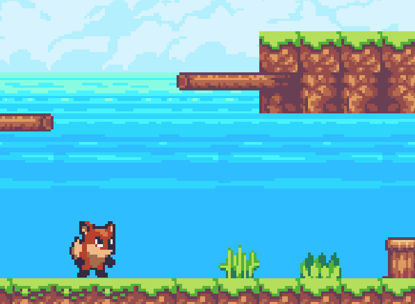

# 四、角色方向 & 跳跃 Jump

​	**1.角色方向**

​		在 Transform 中的 Scale 有 X、Y、Z 三个值，默认为 1。它的意思是对象的某方向缩放比例程度

​		如果我们把 X 的值由 1 改为 -1，可以发现原本朝向右的小狐狸现在朝向了左，如下图：

​		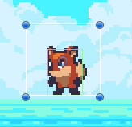 

​		同理，我们可以更改 Y 或 Z达到不同的效果。

​		接下来我们从代码中获取对象的朝向，以及通过按键更换朝向。

​		代码片段：
```c#
    void Movement()
    {
        float horizontal_move;//用于获取Input的值，-1往左，+1往右
        float face_direction;//用于获取输入的朝向,-1往左，+1往右

        horizontal_move = Input.GetAxis("Horizontal");
        face_direction = Input.GetAxisRaw("Horizontal");

        if (horizontal_move != 0)//如果水平方向值不为 0 
        {
            rb.velocity = new Vector2(horizontal_move * speed, rb.velocity.y);
            //刚体的运动速度 为 2D的向量， x方向速度就是水平方向值 乘以 速度， 而 y方向上不变
        }

        if(face_direction != 0)
        {
            transform.localScale = new Vector3(face_direction, 1, 1);
        }
    }
```

​		效果：

​		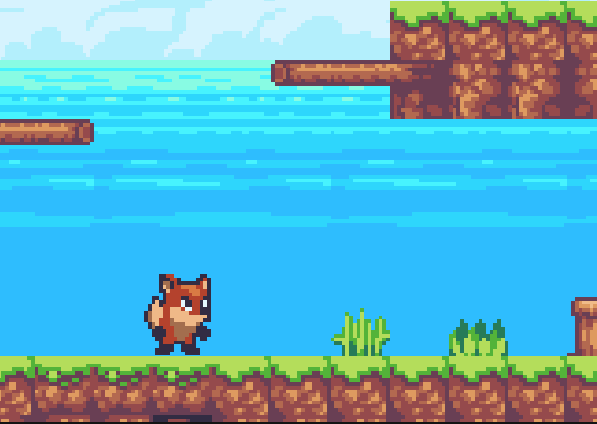

​		**2.FixedUpdated**

​			为了使游戏在不同配置的设备上有相同的帧率，我们将 Update 函数改为 FixedUpdate 函数。

​			Update 是每一帧执行一次，而 FixedUpdate 则会根据设备的物理时间执行。

​			b.velocity = new Vector2(horizontalMove * speed * Time.deltaTime, rb.velocity.y);

​			speed 乘上物理时间 Time.deltaTime，deltaTime代表两帧之间的间隔时间。

​		**3.跳跃**

​			同样，在 Edit --> Project Settings --> Input --> Axes(轴线) 中可以找到 Jump，默认的跳跃键是空格 Space

​			代码片段：
```c#
        if(Input.GetButtonDown("Jump"))
        {
            rb.velocity = new Vector2(rb.velocity.x, jumpforce * Time.deltaTime);
        }
```

​			效果:

​			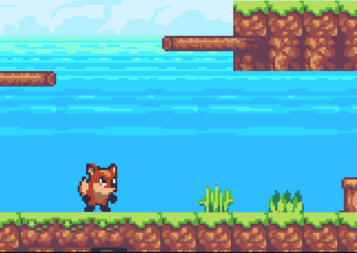

# 五、动画效果 Animation

​	**1.Animation**

​					首先我们在 Assets 文件夹下创建 Animation 文件夹，用于存放动画文件。

​					在 Player 中添加组件 Animator

​					然后新建一个 Animation Controller，命名为 Player ，将其添加到 Player 的 Animator中。

​					接着，调出 Animation 窗口，并将对应的动画图片素材拖拽到时间轴里，通过调整时间轴得到合适的动画效果。

​					idle(闲置) & run（跑动）:

​					 

​					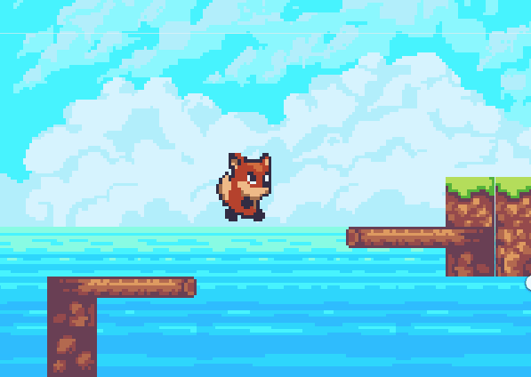

​					如何让闲置状态与跑动状态动画之间有衔接呢？

​					**创建过渡：**

​					在视窗 Animator 中对 idle **make translation** 箭头中指向 run， 同样， run 也 **make translation** 箭头指向 idle。

​					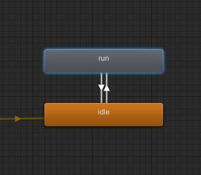

​					修改变化箭头

​					去掉  Has Exit Time
​					Transition Duration 设置成 0	

​					为了获取运动状态，还需要在视窗 Animator 的 parameters 中 设置变化参数 running（浮点型）

​					并将Player Animation  加到 Player

​					然后还需要在脚本代码中添加对应的判断语句。

​					代码片段：
```c#
public Animator anim;
animator.SetFloat("running", Mathf.Abs(face_direction));
```

​					**My reuslt：**

​					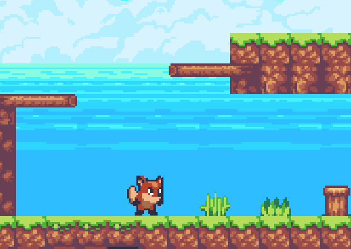

# 六、跳跃动画 & LayerMask

**1.跳跃动画**

跳跃动画简单地有两种状态 ： **jumping** 和 **falling**

然后可以分析出不同之间状态的转换：

idle & run 都在 jumping == true 时进入 jump;

jump 在 jumping == false && falling == true 时进入 fall；

fall 在 falling == false && idle == true 时进入 idle;

在视窗 Animator 中我们可以添加对应的 **bool** 型变量，通过 make translation 连接不同的动画状态并设置判断条件，最后在脚本代码中，实现具体代码。

+ 如何实现下落过程中碰撞到地面（地图的碰撞体）后停止下落动画并转为闲置动画？

  首先为 Tilemap 添加 Layer， 新建一个名为 Ground 的 Layer：

  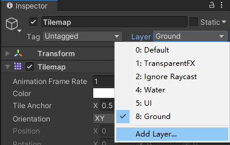

  然后新建碰撞体对象：

  ```c#
  public Collider2D coll;//碰撞体
  ```
  
  并将 Player 的 Box Collider 2D 组件与其绑定。
  
  最后将
  ```c#
  public LayerMask ground;//地面
  ```
  
  与前面的 **Ground** Layer绑定：
  
  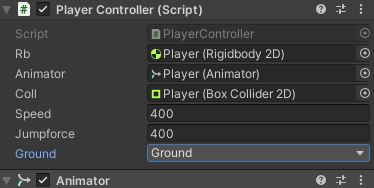

代码片段：

```c#
    //动画切换
    void SwitchAnim()
    {
        animator.SetBool("idle", false);
        if(animator.GetBool("jumping"))//如果正在跳跃
        {
            //如果当前的跳跃力小于 0，则变为下落状态
            if(rb.velocity.y < 0)
            {
                animator.SetBool("jumping",false);
                animator.SetBool("falling", true);
            }
        }
        //与地面碰撞：如果下落到地面，则由下落状态转为闲置状态
        else if(coll.IsTouchingLayers(ground))
        {
            animator.SetBool("falling", false);
            animator.SetBool("idle", true);
        }
    }  
```

**My result:**

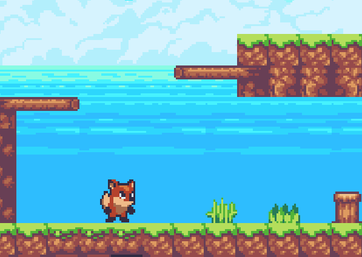

**2.修复移动错误**

+ 为什么取消z轴冻结后，会出现角色转动。

原因是横向赋予速度时，刚体会产生推背效果。

解决办法：下半身用球状碰撞体。

# 七、镜头控制 Cinemachine

**1.添加 CameraControl脚本代码**

与之间对我们的小狐狸创建 PlayerController类似，现在我们对镜头 Main Camera 创建 CameraContrl 脚本代码。

代码片段：
```c#
public class CameraControl : MonoBehaviour
{
    public Transform player;

    // Update is called once per frame
    void Update()
    {
        this.transform.position = new Vector3(player.position.x, player.position.y, -10f);
    }
}
```

我们在镜头控制代码里获得了创建了 Transform 对象 player,并由它来获得 Player 的 Transform 属性，在每一帧更新函数 Update 中，设置镜头的 transform 属性与 Player 的 position 的 x、y 坐标保持一致，这样既可是镜头始终跟随我们的角色。

如果我们希望镜头在 y 轴方向不跟随角色，则设置镜头的 position.y 为 0 既可。

**2.Cinemachine**

安装插件 Cinemachine: window --> PackageManager --> Cinemachine

在 Cinemachine 中 Create 2D Camera。

添加后，原有的 Main Camera 的参数将会替换掉。

CinemachineVirtualCamera 中的 Follow 表示我们的镜头即将要跟随什么角色，于是我们将 Player 拖拽到这里。

Lens： 调整镜头

Body：

**Dead Zone** : 可以设置一个镜头锁死区域，当角色在区域里时，镜头不会移动；但角色离开区域后，镜头开始跟随角色。

**Screen**：可以调整镜头位置

**3.CinemachineConfiner**

+ 怎么使我们的角色在移动时，镜头不会超出边界呢 ?

  首先在CM vcam1 --> Extensions --> Add Extensions 的下拉框中选择 Cinemachine Confiner.

  这其实就是限制了在哪一个 2D 范围内可以移动我们的镜头。

  于是我们可以为我们的背景创建一个多边形碰撞体 Polygon Conllider 2D。

  然后编辑大小，使其大致与地图形状一致。（Ctrl + 边 可以删除不需要的边）

  **勾选 Is Trigger** : 因为地图也是一个碰撞体，由于我们的角色也是一个碰撞体，它会把我们的角色弹出。

  将 Background 拖拽到 Cinemachine Confiner 的 Bounding Shape 2D 中，即可实现与 Background 的 Polygon Conllider 2D 的绑定。
  
  再继续调整摄像头大小，使其大致产生不会由于超出边界卡顿的效果。
  

**My result：**

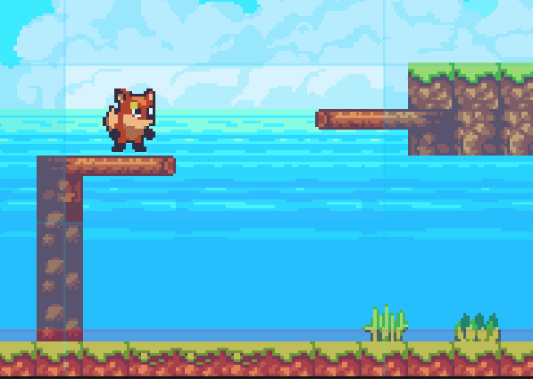

# 八、物品收集 & Perfabs

**1.创建 Cherry 对象**

与前面创建 Player 类似，我们新建了一个 Cherry 对象，并给它添加了动画效果：

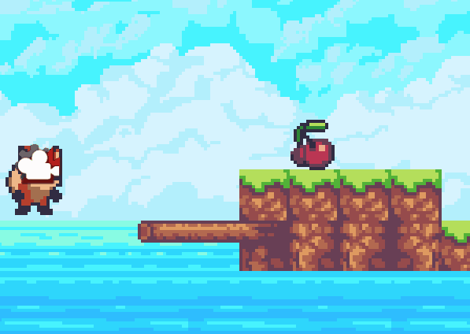

接下来我们要实现人物碰撞到樱桃后收集樱桃

首先为 Cherry 添加碰撞体 Box Collider 2D, 并勾选 **Is Trigger**

然后新建一个标签（Tag） Collection，将 Cherry 的 Tag 设置为 Collection.

之后再 PlayerController.cs 脚本代码中编写人物碰撞樱桃后收集樱桃的逻辑代码

代码片段：
```c#
    private void OnTriggerEnter2D(Collider2D other) {
        //如果当前碰撞的物体标签是我们选定的 Collection 则销毁对应的对象
        if(other.tag == "Collection") {
            Destroy(other.gameObject);
        }
    }
```

效果：

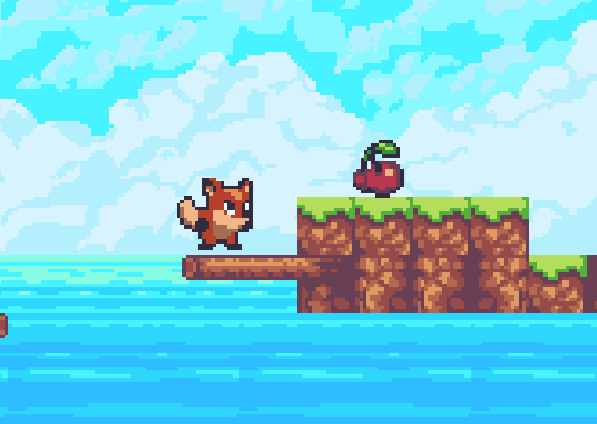

添加 int 型变量 Cherry 记录获取到的樱桃数量。

**2.Prefabs**
prefab:  预制体

我们在 Assets 中创建 Prefabs 文件夹，把我们需要重复使用的游戏对象保存，这样在所有的有用到这些游戏对象的地方都可以实现同步更改参数。

**3.设计游戏画面**

通过添加游戏素材，图片分层，来绘制我们的游戏地图。

**My reuslt：**

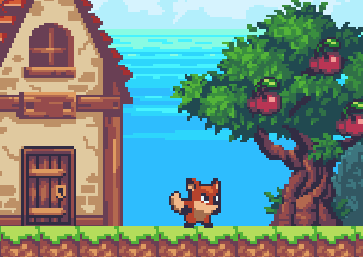

# 九、物理材质 & 空中跳跃

**1.解决人物碰撞墙体会卡住的问题**

在 Assets 中新建 Phyics Material 2D

在 Assets 文件夹下新建 Physics Material 2D

设置它的 Friction（摩擦力）为 0，即光滑效果 

将其添加至 Player 的 Box Collider 2D

**2.解决人物无限跳跃的问题（实现二段跳？）**

编写逻辑代码：
```c#
       //角色跳跃(实现二段跳)
        if(Input.GetButtonDown("Jump"))
        {
            if (coll.IsTouchingLayers(ground))//如果跳跃前在地面
            {
                rb.velocity = new Vector2(rb.velocity.x, jumpforce * Time.deltaTime);
                animator.SetBool("jumping", true);
                jump_num = 1;//跳起一次
            }
            else if(animator.GetBool("jumping") && jump_num == 1) {//如果已经在空中跳起一次
                rb.velocity = new Vector2(rb.velocity.x, jumpforce * Time.deltaTime);
                jump_num = 2;//已经二段跳
            }
        }
```

**3.做一个匍匐前进效果？**

我们有两个碰撞体 **Box Collider** 和 **Circle Collider**，其中，Circle Collider 主要与地面判断，而Box Collider 可以控制其长宽来与除地面的物体来进行判断。

代码片段：
```c#
        //角色匍匐前进
        if(Input.GetKey(KeyCode.S)) 
        {
            if(coll.IsTouchingLayers(ground))
            {
                coll_creep.enabled = false;
                //设置 Box Collider 不可用，这样就可以以较低的 Circle Collider通过了
                animator.SetBool("creeping", true);
            }
        }
        else 
        {
            coll_creep.enabled = true;
            animator.SetBool("creeping", false);
        }
```

**My result:**

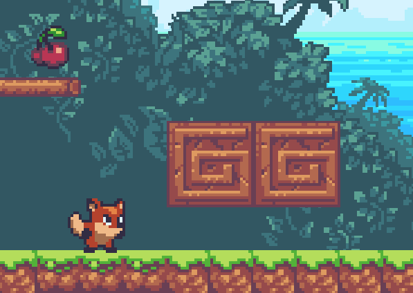

# 十、 UI入门

**1.Canvas**

tips: 选中一个对象后，按键盘<kbd>F</kbd>键(或<kbd>shift</kbd> + <kbd>F</kbd>)可以快速 Focus on 到对象。

新建 UI --> Canvas; 在 Canvas 中新建 Text。

tips:要将两个UI组件对齐以及调整大小，用 Rect Tools (键盘<kbd>T</kbd>)。

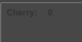

右边的数字代表我们收集到的樱桃数量或得分。

接下来在代码中将 UI 中的 Text 与变量绑定。

我们新建一个 **Text** 类型的变量 cherry_num， 需要要引用命名空间 **UnityEngine.UI**
```c#
cherry_num.text = Cherry.ToString();
```

**2.设置锚点**

在不同比例的游戏界面下，UI可能不显示，这是因为没有确定UI对象的相对位置。

点击UI对象，在 Rect Transform 中设置对象始终在哪个位置显示。

**My reuslt：**

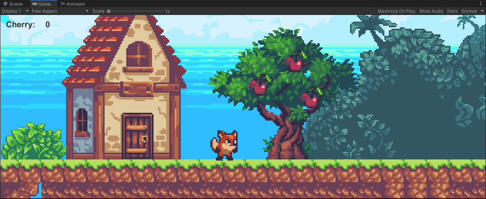

# 十一、敌人 Enemy

**1.新建 Frog**

与 Player 类似，新建 Sprite ，显示图层、添加动画效果、添加刚体、添加碰撞体。

**2.编写敌人机制代码**

给 Frog 添加 标签 Enemy

与 OnTriggerEnter2D 不同，在 **OnCollisionEnter2D** 函数中，如果我们要获得 Collision2D 的 tag，需要先获取它的 **gameObject**。

代码片段:
```c#
    private void OnCollisionEnter2D(Collision2D other) {
        //如果人物正在掉落，则通过“踩踏”消灭敌人
        if(animator.GetBool("falling")) {
            if(other.gameObject.tag == "Enemy") {
                Destroy(other.gameObject);
                //消灭后，还有一个小段的跳跃效果
                rb.velocity = new Vector2(rb.velocity.x, jumpforce * Time.deltaTime);
                animator.SetBool("jumping", true);
            }
        }
    }
```

**My result:**

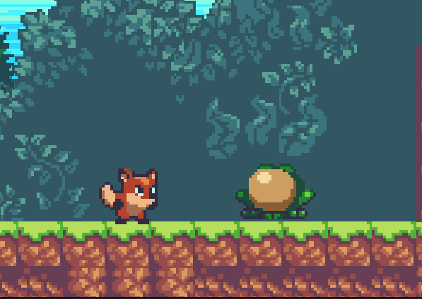