# 我的Unity学习笔记

## 一、素材编辑：

​	**1.Hierarchy			---层级**

​		

​	**2.打开一幅图片素材**

​	Pixels Per Unit			---每单位像素网格的像素点

​	**默认为 100，用不到那么多，学习项目中改为了 16。**

​	**3.左上角操作图标**

​	

​	从左到右:

​	快捷键是 <kbd>Q</kbd> <kbd>W</kbd> <kbd>E</kbd> <kbd>R</kbd> <kbd>T</kbd> <kbd>Y</kbd> 

​	Hand Tool:	移动你的视角，不移动素材

​	Move Tool:	点击后拖拽移动素材

​	Rotate Tool:

​	Scale Tool:

​	Rect Tool:

​	Move, Rotate or Scale selected objects:

​	**4.Tilemap			---瓦图**

​	 	打开Tile palette			---瓦片调色板

​		新建map文件夹，调整 Sprite Mode 设置为 Multiple，使用 Sprite Editor 中的 Slice 对图片中的		素材切分。

​		Slice： 可以选择切片方式，Automatic为自动切割，但有时候不能达到我们想要的结果，于是我们可以使用 Grid By Cell Size 或者 Grid By Cell Count 来自定义切割

​		Grid By Cell Size：直接设置的像素单元格大小为 16 ，所以这里可以设置切割的Pixel Size 的 XY为16。

​		绘制你的 Tilemap：将切割好的素材图片拖拽到 Tile palette 中，使用笔刷按钮“paint with active brush(B)”,选择你想用的小图片填充到 Scene 中小单元格中。

​	**My result：**

​		

## 二、图层layer & 角色建立

​	**1.Sorting Layer**

​		对于每个 scene 我们要设置它的图层，使得它们的堆叠达到我们想要的结果，比如背景是蔚蓝色的天空，天空前面则是我们的地图。在 Sorting Layer 下拉框中，我们可以自定义添加图层，它的排序规则是，排在越下面的图层类型越会出现在屏幕的前面。即 ：back -->  front。

​		当我们的图形设置在了统一图层，我们可以修改 Order in Layer。数字越大越显示在屏幕前方。

​	**2.Player**

​		如果添加的  Player（拖拽到 sprite） 没有在 Game 里显示，则 Reset。

​		Add Component : 添加组件

​		可以为我们的对象添加各种组件如脚本、渲染效果、物理效果等。

​		在 2D Game 中，常用的组件 Rigidbody 2D (刚体) : 把对象转换成”实际的物体“。

​		Conllider : 碰撞体 

​		Box Conllider 2D ：碰撞箱

​		我们可以为 Player 设置一个碰撞箱，可以使用 Edit Conllider 编辑它的大小。

​		然后将我们的 Tilemap 设置一个 Tilemap Conllider，同样使地图也成为一个碰撞体。

​	**My result:**

​	

# 三、角色移动 Move

​	**1.输入方向键**

​		Edit --> Project Settings --> Input --> Axes(轴线) --> Horizontal(横向移动)

​		在这里可以自己更改和添加按键

​	**2.添加脚本代码 Script**

​		在 Player 中 Add Component --> new Script,创建后文件在 Assets的根目录下。

​		为了规范化，我们新建文件夹 Scripts，用于存放我们所有的 Script代码。

​		编写代码使用的高级程序语言是C#，使用的IDE可以选择 Visual Studio 或者 Visual Studio Code 等，根据个人习惯，这里我所使用的是 VS Code。二者若需要Unity代码提示等功能都可下载Unity相关扩展插件。

​		<u>如果遇到了 IDE 无法是用代码补全的问题，进入Edit --> Preference --> External Tools --> External Script Editor 设置为你所用的 IDE。</u>

​		如果是新建的一个Unity工程，打开C#脚本后输入关键词发现并没提示或者补全功能，这个问题也好解决，就是**缺少.sln**文件，解决方法如下：

​		**Assets->Open C# Project**，会自动打开VSCode，这时发现工程的根目录已经生成**.sln**文件，这时再输入关键词就有提示和补全功能。（转自简书）

​	**3.编写代码**

​			PlayerController.cs :

```c#
using System.Collections;
using System.Collections.Generic;
using UnityEngine;

public class PlayerController : MonoBehaviour
{
    public Rigidbody2D rb;
    public float speed;

    // Start is called before the first frame update
    void Start()
    {
        
    }

    // Update is called once per frame 每一帧更新
    void Update()
    {
        Movement();
    }

    void Movement()
    {
        float horizontal_move;//用于获取Input的值，-1往左，+1往右
        horizontal_move = Input.GetAxis("Horizontal");

        if (horizontal_move != 0)//如果水平方向值不为 0 
        {
            rb.velocity = new Vector2(horizontal_move * speed, rb.velocity.y);
            //刚体的运动速度 为 2D的向量， x方向速度就是水平方向值 乘以 速度， 而 y方向上不变
        }
    }
}
```

​	**4.tips & result**

​		在 Game 界面调试时，如果我们发现了手感比较好的参数，可以点击组件右上角的齿轮设置里的 Copy Component 拷贝参数，从而获得更好的参数，达到想要的效果。

​		**My reuslt：**

​		

# 四、角色方向 & 跳跃 Jump

​	**1.角色方向**

​		在 Transform 中的 Scale 有 X、Y、Z 三个值，默认为 1。它的意思是对象的某方向缩放比例程度

​		如果我们把 X 的值由 1 改为 -1，可以发现原本朝向右的小狐狸现在朝向了左，如下图：

​		 

​		同理，我们可以更改 Y 或 Z达到不同的效果。

​		接下来我们从代码中获取对象的朝向，以及通过按键更换朝向。

​		代码片段：
```c#
    void Movement()
    {
        float horizontal_move;//用于获取Input的值，-1往左，+1往右
        float face_direction;//用于获取输入的朝向,-1往左，+1往右

        horizontal_move = Input.GetAxis("Horizontal");
        face_direction = Input.GetAxisRaw("Horizontal");

        if (horizontal_move != 0)//如果水平方向值不为 0 
        {
            rb.velocity = new Vector2(horizontal_move * speed, rb.velocity.y);
            //刚体的运动速度 为 2D的向量， x方向速度就是水平方向值 乘以 速度， 而 y方向上不变
        }

        if(face_direction != 0)
        {
            transform.localScale = new Vector3(face_direction, 1, 1);
        }
    }
```

​		效果：

​		

​		**2.FixedUpdated**

​			为了使游戏在不同配置的设备上有相同的帧率，我们将 Update 函数改为 FixedUpdate 函数。

​			Update 是每一帧执行一次，而 FixedUpdate 则会根据设备的物理时间执行。

​			b.velocity = new Vector2(horizontalMove * speed * Time.deltaTime, rb.velocity.y);

​			speed 乘上物理时间 Time.deltaTime，deltaTime代表两帧之间的间隔时间。

​		**3.跳跃**

​			同样，在 Edit --> Project Settings --> Input --> Axes(轴线) 中可以找到 Jump，默认的跳跃键是空格 Space

​			代码片段：
```c#
        if(Input.GetButtonDown("Jump"))
        {
            rb.velocity = new Vector2(rb.velocity.x, jumpforce * Time.deltaTime);
        }
```

​			效果:

​			

# 五、动画效果 Animation

​	**1.Animation**

​					首先我们在 Assets 文件夹下创建 Animation 文件夹，用于存放动画文件。

​					在 Player 中添加组件 Animator

​					然后新建一个 Animation Controller，命名为 Player ，将其添加到 Player 的 Animator中。

​					接着，调出 Animation 窗口，并将对应的动画图片素材拖拽到时间轴里，通过调整时间轴得到合适的动画效果。

​					idle(闲置) & run（跑动）:

​					 

​					

​					如何让闲置状态与跑动状态动画之间有衔接呢？

​					**创建过渡：**

​					在视窗 Animator 中对 idle **make translation** 箭头中指向 run， 同样， run 也 **make translation** 箭头指向 idle。

​					

​					修改变化箭头

​					去掉  Has Exit Time
​					Transition Duration 设置成 0	

​					为了获取运动状态，还需要在视窗 Animator 的 parameters 中 设置变化参数 running（浮点型）

​					并将Player Animation  加到 Player

​					然后还需要在脚本代码中添加对应的判断语句。

​					代码片段：
```c#
public Animator anim;
animator.SetFloat("running", Mathf.Abs(face_direction));
```

​					**My reuslt：**

​					

# 六、跳跃动画 & LayerMask

**1.跳跃动画**

跳跃动画简单地有两种状态 ： **jumping** 和 **falling**

然后可以分析出不同之间状态的转换：

idle & run 都在 jumping == true 时进入 jump;

jump 在 jumping == false && falling == true 时进入 fall；

fall 在 falling == false && idle == true 时进入 idle;

在视窗 Animator 中我们可以添加对应的 **bool** 型变量，通过 make translation 连接不同的动画状态并设置判断条件，最后在脚本代码中，实现具体代码。

+ 如何实现下落过程中碰撞到地面（地图的碰撞体）后停止下落动画并转为闲置动画？

  首先为 Tilemap 添加 Layer， 新建一个名为 Ground 的 Layer：

  

  然后新建碰撞体对象：

  ```c#
  public Collider2D coll;//碰撞体
  ```
  
  并将 Player 的 Box Collider 2D 组件与其绑定。
  
  最后将
  ```c#
  public LayerMask ground;//地面
  ```
  
  与前面的 **Ground** Layer绑定：
  
  

代码片段：

```c#
    //动画切换
    void SwitchAnim()
    {
        animator.SetBool("idle", false);
        if(animator.GetBool("jumping"))//如果正在跳跃
        {
            //如果当前的跳跃力小于 0，则变为下落状态
            if(rb.velocity.y < 0)
            {
                animator.SetBool("jumping",false);
                animator.SetBool("falling", true);
            }
        }
        //与地面碰撞：如果下落到地面，则由下落状态转为闲置状态
        else if(coll.IsTouchingLayers(ground))
        {
            animator.SetBool("falling", false);
            animator.SetBool("idle", true);
        }
    }  
```

**My result:**


**2.修复移动错误**

+ 为什么取消z轴冻结后，会出现角色转动。

原因是横向赋予速度时，刚体会产生推背效果。

解决办法：下半身用球状碰撞体。

# 七、镜头控制 Cinemachine

**1.添加 CameraControl脚本代码**

与之间对我们的小狐狸创建 PlayerController类似，现在我们对镜头 Main Camera 创建 CameraContrl 脚本代码。

代码片段：
```c#
public class CameraControl : MonoBehaviour
{
    public Transform player;

    // Update is called once per frame
    void Update()
    {
        this.transform.position = new Vector3(player.position.x, player.position.y, -10f);
    }
}
```

我们在镜头控制代码里获得了创建了 Transform 对象 player,并由它来获得 Player 的 Transform 属性，在每一帧更新函数 Update 中，设置镜头的 transform 属性与 Player 的 position 的 x、y 坐标保持一致，这样既可是镜头始终跟随我们的角色。

如果我们希望镜头在 y 轴方向不跟随角色，则设置镜头的 position.y 为 0 既可。

**2.Cinemachine**

安装插件 Cinemachine: window --> PackageManager --> Cinemachine

在 Cinemachine 中 Create 2D Camera。

添加后，原有的 Main Camera 的参数将会替换掉。

CinemachineVirtualCamera 中的 Follow 表示我们的镜头即将要跟随什么角色，于是我们将 Player 拖拽到这里。

Lens： 调整镜头

Body：

**Dead Zone** : 可以设置一个镜头锁死区域，当角色在区域里时，镜头不会移动；但角色离开区域后，镜头开始跟随角色。

**Screen**：可以调整镜头位置

**3.CinemachineConfiner**

+ 怎么使我们的角色在移动时，镜头不会超出边界呢 ?

  首先在CM vcam1 --> Extensions --> Add Extensions 的下拉框中选择 Cinemachine Confiner.

  这其实就是限制了在哪一个 2D 范围内可以移动我们的镜头。

  于是我们可以为我们的背景创建一个多边形碰撞体 Polygon Conllider 2D。

  然后编辑大小，使其大致与地图形状一致。（Ctrl + 边 可以删除不需要的边）

  **勾选 Is Trigger** : 因为地图也是一个碰撞体，由于我们的角色也是一个碰撞体，它会把我们的角色弹出。

  将 Background 拖拽到 Cinemachine Confiner 的 Bounding Shape 2D 中，即可实现与 Background 的 Polygon Conllider 2D 的绑定。
  
  再继续调整摄像头大小，使其大致产生不会由于超出边界卡顿的效果。
  

**My result：**


# 八、物品收集 & Perfabs

**1.创建 Cherry 对象**

与前面创建 Player 类似，我们新建了一个 Cherry 对象，并给它添加了动画效果：


接下来我们要实现人物碰撞到樱桃后收集樱桃

首先为 Cherry 添加碰撞体 Box Collider 2D, 并勾选 **Is Trigger**

然后新建一个标签（Tag） Collection，将 Cherry 的 Tag 设置为 Collection.

之后再 PlayerController.cs 脚本代码中编写人物碰撞樱桃后收集樱桃的逻辑代码

代码片段：
```c#
    private void OnTriggerEnter2D(Collider2D other) {
        //如果当前碰撞的物体标签是我们选定的 Collection 则销毁对应的对象
        if(other.tag == "Collection") {
            Destroy(other.gameObject);
        }
    }
```

效果：


添加 int 型变量 Cherry 记录获取到的樱桃数量。

**2.Prefabs**
prefab:  预制体

我们在 Assets 中创建 Prefabs 文件夹，把我们需要重复使用的游戏对象保存，这样在所有的有用到这些游戏对象的地方都可以实现同步更改参数。

**3.设计游戏画面**

通过添加游戏素材，图片分层，来绘制我们的游戏地图。

**My reuslt：**


# 九、物理材质 & 空中跳跃

**1.解决人物碰撞墙体会卡住的问题**

在 Assets 中新建 Phyics Material 2D

在 Assets 文件夹下新建 Physics Material 2D

设置它的 Friction（摩擦力）为 0，即光滑效果 

将其添加至 Player 的 Box Collider 2D

**2.解决人物无限跳跃的问题（实现二段跳？）**

编写逻辑代码：
```c#
       //角色跳跃(实现二段跳)
        if(Input.GetButtonDown("Jump"))
        {
            if (coll.IsTouchingLayers(ground))//如果跳跃前在地面
            {
                rb.velocity = new Vector2(rb.velocity.x, jumpforce * Time.deltaTime);
                animator.SetBool("jumping", true);
                jump_num = 1;//跳起一次
            }
            else if(animator.GetBool("jumping") && jump_num == 1) {//如果已经在空中跳起一次
                rb.velocity = new Vector2(rb.velocity.x, jumpforce * Time.deltaTime);
                jump_num = 2;//已经二段跳
            }
        }
```

**3.做一个匍匐前进效果？**

我们有两个碰撞体 **Box Collider** 和 **Circle Collider**，其中，Circle Collider 主要与地面判断，而Box Collider 可以控制其长宽来与除地面的物体来进行判断。

代码片段：
```c#
        //角色匍匐前进
        if(Input.GetKey(KeyCode.S)) 
        {
            if(coll.IsTouchingLayers(ground))
            {
                coll_creep.enabled = false;
                //设置 Box Collider 不可用，这样就可以以较低的 Circle Collider通过了
                animator.SetBool("creeping", true);
            }
        }
        else 
        {
            coll_creep.enabled = true;
            animator.SetBool("creeping", false);
        }
```

**My result:**


# 十、 UI入门

**1.Canvas**

tips: 选中一个对象后，按键盘<kbd>F</kbd>键(或<kbd>shift</kbd> + <kbd>F</kbd>)可以快速 Focus on 到对象。

新建 UI --> Canvas; 在 Canvas 中新建 Text。

tips:要将两个UI组件对齐以及调整大小，用 Rect Tools (键盘<kbd>T</kbd>)。


右边的数字代表我们收集到的樱桃数量或得分。

接下来在代码中将 UI 中的 Text 与变量绑定。

我们新建一个 **Text** 类型的变量 cherry_num， 需要要引用命名空间 **UnityEngine.UI**
```c#
cherry_num.text = Cherry.ToString();
```

**2.设置锚点**

在不同比例的游戏界面下，UI可能不显示，这是因为没有确定UI对象的相对位置。

点击UI对象，在 Rect Transform 中设置对象始终在哪个位置显示。

**My reuslt：**


# 十一、敌人 Enemy

**1.新建 Frog**

与 Player 类似，新建 Sprite ，显示图层、添加动画效果、添加刚体、添加碰撞体。

**2.编写敌人机制代码**

给 Frog 添加 标签 Enemy

与 OnTriggerEnter2D 不同，在 **OnCollisionEnter2D** 函数中，如果我们要获得 Collision2D 的 tag，需要先获取它的 **gameObject**。

代码片段:
```c#
    private void OnCollisionEnter2D(Collision2D other) {
        //如果人物正在掉落，则通过“踩踏”消灭敌人
        if(animator.GetBool("falling")) {
            if(other.gameObject.tag == "Enemy") {
                Destroy(other.gameObject);
                //消灭后，还有一个小段的跳跃效果
                rb.velocity = new Vector2(rb.velocity.x, jumpforce * Time.deltaTime);
                animator.SetBool("jumping", true);
            }
        }
    }
```

**My result:**


# 十二、 受伤效果 Hurt

**1.添加判断是否受伤的 BOOL 变量**
```c#
private bool isHurt;//是否受伤
```

**2.判断碰撞**

代码片段（**OnCollisionEnter2D**函数中）:
```c#
//判断人物在敌人的左右侧,添加一个反弹效果
else if(transform.position.x != other.gameObject.transform.position.x) {
    int rebound = transform.position.x -	other.gameObject.transform.position.x < 0 ? -1 : 1;
    rb.velocity = new Vector2(5 * rebound, rb.velocity.y);
    isHurt = true;
}
```

**3.移动与受伤的冲突**

对于 FixedUpdate 函数来说，如果没有设置 **isHurt** 将无法判断是否受伤，也不会进行 **OnCollisionEnter2D**

函数的判断。**这里或许有更好的优化的地方？**

**4.添加动画效果**

与前面类似，其中，为了后面更多的敌人机制，我们的 **hurt** 效果都可能由 **idle、jump、run** 这些状态得到。

**My result：**

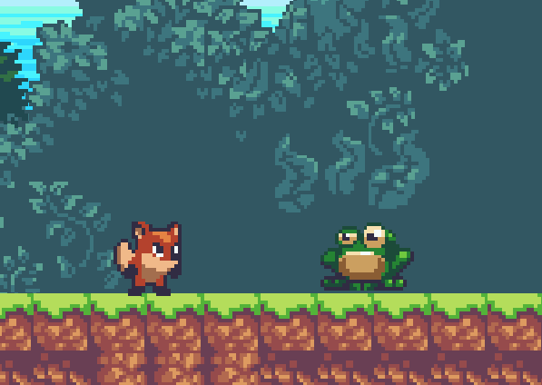

# 十三、AI敌人移动

**1.将 Frog 的碰撞体改为 Circle Collider 2D**

效果更好。

**2.给 Frog 添加脚本代码**

限制 Frog 的移动范围:

在 Frog 下添加子对象 **Left** 和 **Righ**t 分别表示它的左右活动边界。

并将整个 Frog 对象添加到 **Perfabs** 预制体中以便后续添加 Frog，同时可以调整其他 Frog 的左右活动边界。

在设置 Left 时可以添加颜色，使其显眼。

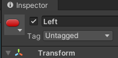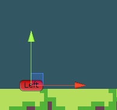

代码片段：
```c#
    void Start()
    {
        rb = GetComponent<Rigidbody2D>();
        transform.DetachChildren();//与子对象分离
        //获得左右边界值，然后销毁子对象
        left_x = left_point.position.x;
        right_x = right_point.position.x;
        Destroy(left_point.gameObject);
        Destroy(right_point.gameObject);
    }
    
    void Movement()
    {
        if(face_left)//如果面向左，则向左移动
        {
            rb.velocity = new Vector2(-speed, rb.velocity.y);
            if(transform.position.x < left_x)//如果到达左边界则朝向右
            {
                transform.localScale = new Vector3(-1, 1, 1);
                face_left = false;
            }
        }
        else //同理，右朝向往右移动
        {
            rb.velocity = new Vector2(speed, rb.velocity.y);
            if(transform.position.x > right_x)
            {
                transform.localScale = new Vector3(1, 1, 1);
                face_left = true;
            }
        }
    }
```

效果：

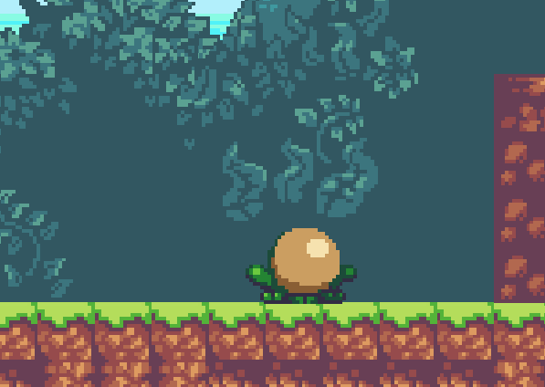

**3.实现青蛙跳跃移动**

资源文件给的青蛙动画有跳跃和下落，青蛙应该是一蹦一蹦的，可以编写代码使青蛙移动更生动形象。

# 十四、 Animation Events 动画事件

**1.add event**

为了实现动画切换效果，我们可以在 Frog 的 idle 动画进行完之后，设置一个触发器 Animation Event，激活代码里的 Movement函数，在 Movement 函数中实现 Frog 的跳跃下落等动画。这样做的话，在 Update 函数中就不用调用 Movement 函数了。

**2.添加切换动画函数 SwitchAnim**

代码片段：
```c#
    void SwithAnim()
    {
        if(animator.GetBool("jumping"))
        {
            if(rb.velocity.y < 0.1f)
            {
                animator.SetBool("jumping", false);
                animator.SetBool("falling", true);
            }
        }
        if(coll.IsTouchingLayers(ground) && animator.GetBool("falling"))
        {
            animator.SetBool("falling", false);
            animator.SetBool("idle", true);
        }
    }
```

**My result:**

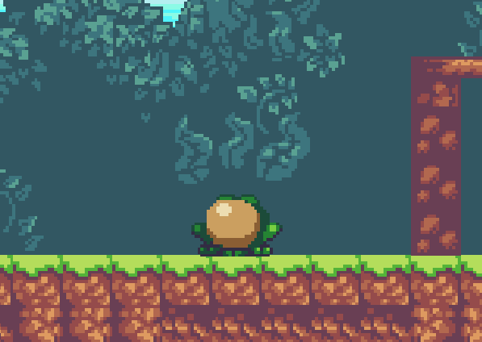

# 十五、Class 调用

**1.添加敌人 Eagle**

为我们的游戏添加新的敌人 老鹰。 给它添加动画效果以及控制它的 AI 使它能上下飞行。

勾选 Eagle 的 rigidbody2D 中的 Freeze Position X, 使老鹰不会因为人物的碰撞而在 x方向上走。

**2.添加敌人死亡效果**

任何时候状态下敌人都会死亡，所以在Animator中 Any State 指向 death

death 参数设置为 trigger

**3.类的使用**

当我们人物消灭敌人后，要做的两件事是产生**敌人死亡动画** 和 **销毁敌人的游戏对象**。

由于判断消灭敌人的代码在 PlayerController 中，而这时我们又要在其中使用敌人游戏对象，于是我们使用面向对象的程序设计思想，在 PlayerController 中新建 Enemy_Frog对象，并调用消灭敌人的函数 **JumpOn()** 。
```c#
Enemy_Frog frog = other.gameObject.GetComponent<Enemy_Frog>();
```

**4.动画事件 Add event**

消灭敌人这一过程中，如果我们销毁了敌人对象，就无法调用敌人死亡的动画；而如果我们先切换了动画，但由于动画是循环播放的，不会继续销毁对象。所以我们应该在死亡动画执行一次完毕后 Add Eevent 设置其调用的函数为 Death(),其功能即为销毁敌人游戏对象。

**My reuslt:**

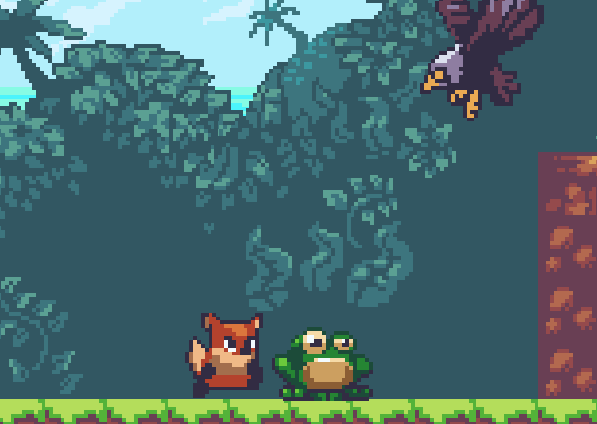

# 十六、Audio 音效

**1.下载音效**

从 Assets Store 中下载需要的**免费**音效素材。这里我下载的游戏音效是 **3rd Note SFX Pack** , 背景音乐是 **CasualGameBGM05**。

**2.添加 Audio Source**

首先为 Player 添加组件 Audio Source ，**如果该组件左边出现蓝色边框，说明未加入到预制体 Perfabs 中**。

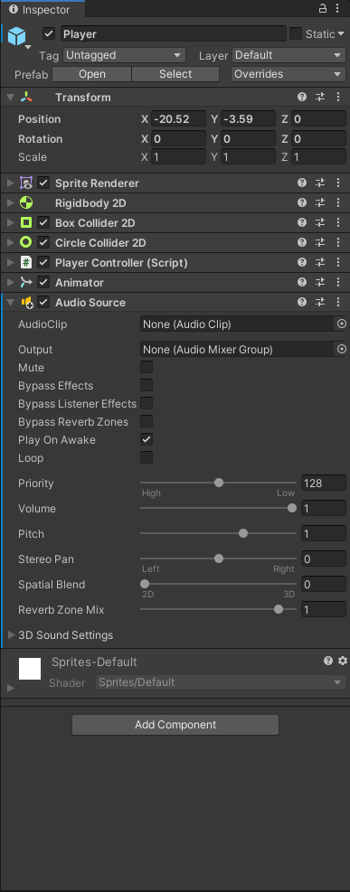

若要将其添加到预制体中，可以点击 **Overrides** 中的 **Apply All** 应用于预制体中。

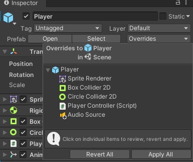

**3.添加声音片段**

找到资源文件中的音乐片段，将其拖拽到 Audio Source 中的 Audio Clip里。

**Play On Awake**：游戏一启动即自动播放

**Loop**：循环播放

# 十七、对话框 Dialog

**1.添加 Panel**

在之前做的 UI 的 **Canvas** 中新建 UI -> **Panel** (面板), 在其 Inspector 中调整其属性（如颜色、位置、大小等）。

**2.添加 Text**

在前面做好的 Panel 中添加 Text，同样可以设置 Text 的内容、颜色、大小、字体等属性。

tips：按住 <kbd>alt</kbd> 可以使中心位置不动调整两边大小。

**3.添加 Dialog 的触发器**

在我们游戏场景中想要触发对话的位置(如房子的门)添加一个 Box Collider 并设置 Is Trigger，即未触发前设置默认为不显示对话。

设置 **Player** 的 Perfabs 的 **Tag** 为 Player。

触发对话的位置游戏对象的代码如下
```c#
public class EnterDialog : MonoBehaviour
{
    public GameObject enterDialog;// 用于获取Dialog对象
    private void OnTriggerEnter2D(Collider2D other) //触发对话
    {
        if(other.tag == "Player")
        {
            enterDialog.SetActive(true);
        }
    }
    private void OnTriggerExit2D(Collider2D other) //离开停止对话
    {
        if(other.tag == "Player")
        {
            enterDialog.SetActive(false);
        }
    }
}
```

**4.给 Dialog 添加动画效果**

在 **Animation** 文件夹下新建 **Dialog** 文件夹，新建 Animation 文件，将其拖拽到游戏对象(**对话框**，而非触发处)处会自动生成它的 Animator。

录制动画：在 Animation 窗口中找到红圈圈(录制按钮), 在每个指定帧之间设置 **Text** 的颜色等属性，实现渐出的效果。第一帧设置对话框和文本的不透明度都为 0，之后的帧提高不透明度。

**My result：**

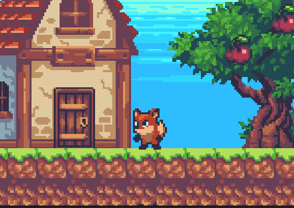

# 十八、趴下 Crouch

1.之前 **匍匐前进 creep** 的问题

+ 判断输入按键用的语句是 Input.GetKey(KeyCode.S)，即判断是否按下了键盘<kbd>s</kbd>键。其实可以在 Edit -> Project Setting -> Input Manager 中新建一个 Crouch （类似 Jump），可以设置其参数。

  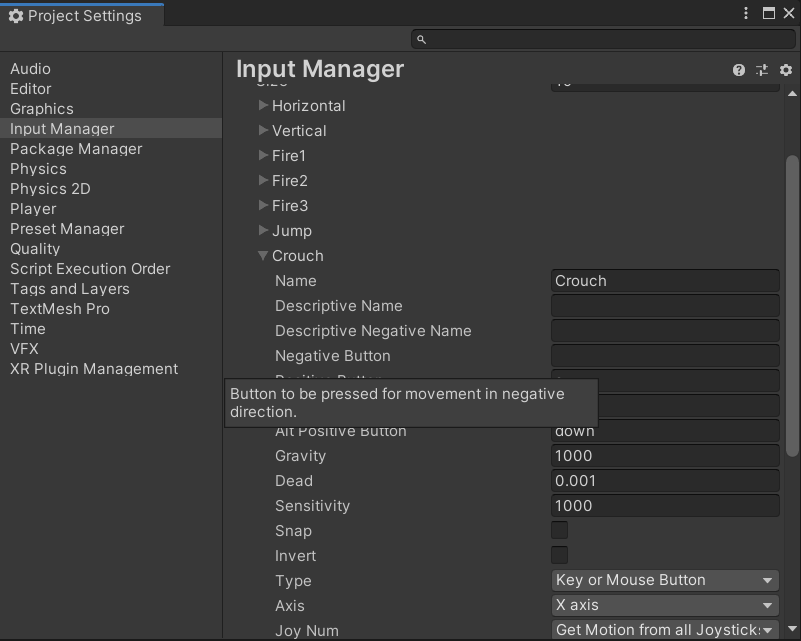

+ 然后是解决碰撞体的问题。趴下就将角色上方的 Box Collider 设置为 false 不可用，这样角色就可以仅凭 Circle Collider 通过矮小通道，这在之前的代码已经实现。然后出现的问题是，当角色已经趴下进入“隧道”，但松开了趴下按键，即角色由趴下状态转换为站立状态时，会与我们的 地面 **Ground** 产生错误的碰撞。

  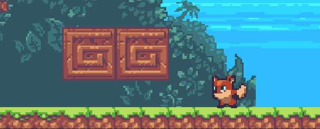

**2.Ceiling**

与之前对敌人的移动范围限制的方法类似，可以在 Player 的上方添加 **Ceiling** 用于判断是否碰撞到了 **Ground** 图层。 这里用到了新的函数 Physics2D.OverlapCircle（） ：三个参数分别是 设置的圆心点位置、 半径 、 判断的图层， 返回 bool。

**tips:** 解决 **趴下 & 跳跃** 时 按键切换动画不流畅的问题： 将 **GetButtonDown** 和 **GetButtonUp** 用 **GetButton** 和 ！**GetButton** 替代。

代码片段：
```c#
        //角色匍匐前进
        if(Physics2D.OverlapCircle(ceiling_check.position, 0.2f, ground) == false)
            //当没有与上方 ground 发生碰撞是正常执行
        {
            if(Input.GetButton("Crouch")) 
            {
                coll_creep.enabled = false;
                //设置 Box Collider 不可用，这样就可以以较低的 Circle Collider通过了
                animator.SetBool("creeping", true);
            }
            else if(!Input.GetButton("Crouch"))
            {
                coll_creep.enabled = true;
                animator.SetBool("creeping", false);
            }
        }
```

**My result:**

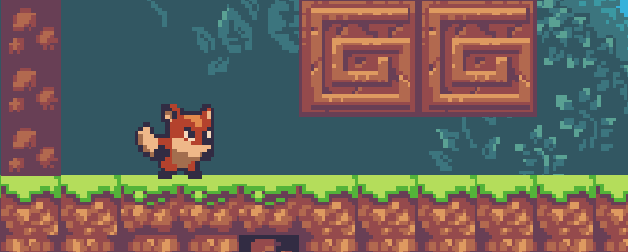

# 十九、场景控制 Scene

**1.碰撞触发器**

角色掉落场景后直接死亡，并重新返回出身点，这个功能可以类似之前的收集物品的功能模块，用触发器实现。

其中用到了 **UnityEngine.SceneManagement** 里面的 **SceneManager.LoadScene()**
```c#
SceneManager.LoadScene(SceneManager.GetActiveScene().name);//获得当前 scene 的名字
```

**2.Restart (延迟效果)**

将重启游戏的代码写进新的函数 Restart() 里, 在将其在触发器函数里调用。

