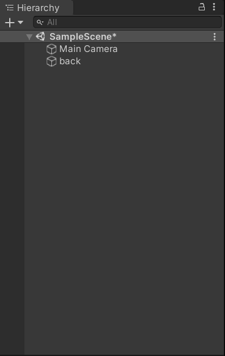
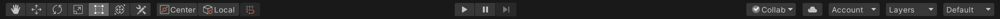
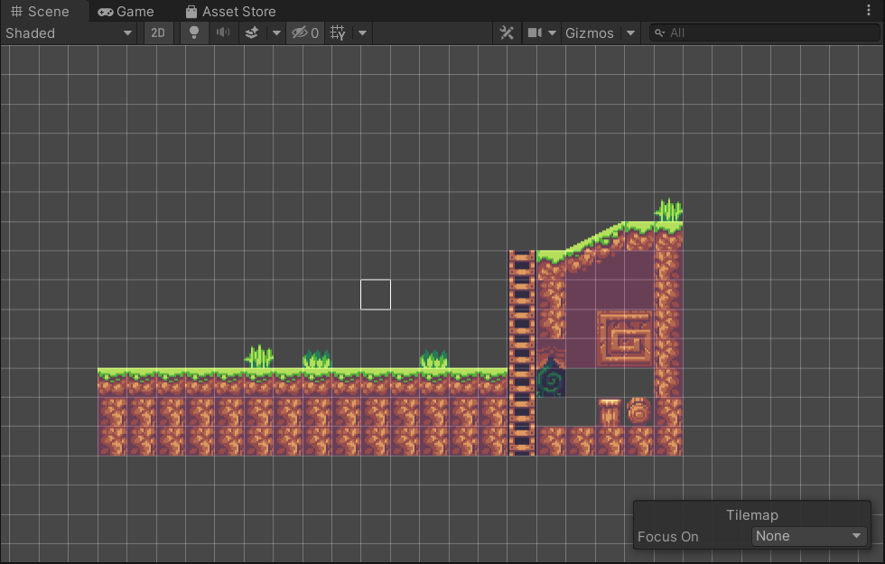
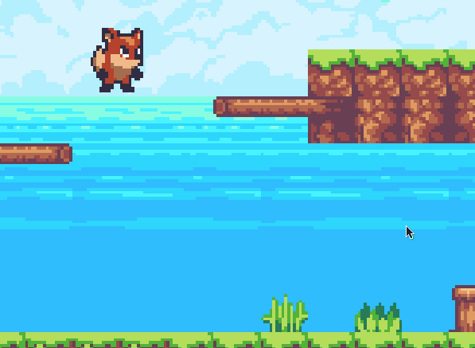
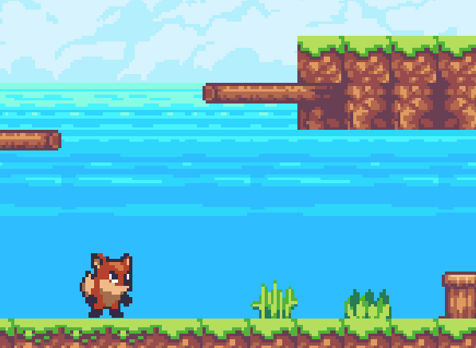
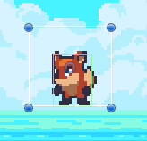
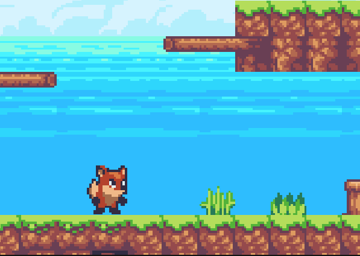
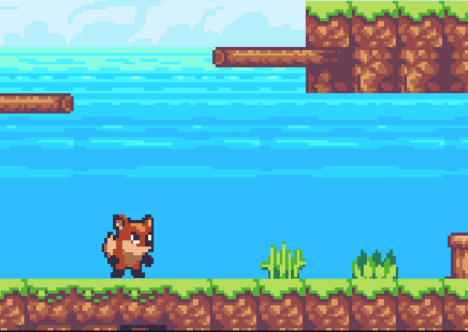

# 我的Unity学习笔记

## 一、素材编辑：

### tips：

​	**1.Hierarchy			---层级**

​		

​	**2.打开一幅图片素材**

​	Pixels Per Unit			---每单位像素网格的像素点

​	**默认为 100，用不到那么多，学习项目中改为了 16。**

​	**3.左上角操作图标**

​	

​	从左到右:

​	快捷键是 <kbd>Q</kbd> <kbd>W</kbd> <kbd>E</kbd> <kbd>R</kbd> <kbd>T</kbd> <kbd>Y</kbd> 

​	Hand Tool:	移动你的视角，不移动素材

​	Move Tool:	点击后拖拽移动素材

​	Rotate Tool:

​	Scale Tool:

​	Rect Tool:

​	Move, Rotate or Scale selected objects:

​	**4.Tilemap			---瓦图**

​	 	打开Tile palette			---瓦片调色板

​		新建map文件夹，调整 Sprite Mode 设置为 Multiple，使用 Sprite Editor 中的 Slice 对图片中的		素材切分。

​		Slice： 可以选择切片方式，Automatic为自动切割，但有时候不能达到我们想要的结果，于是我们可以使用 Grid By Cell Size 或者 Grid By Cell Count 来自定义切割

​		Grid By Cell Size：直接设置的像素单元格大小为 16 ，所以这里可以设置切割的Pixel Size 的 XY为16。

​		绘制你的 Tilemap：将切割好的素材图片拖拽到 Tile palette 中，使用笔刷按钮“paint with active brush(B)”,选择你想用的小图片填充到 Scene 中小单元格中。

​	**My result：**

​		

## 二、图层layer & 角色建立

​	**1.Sorting Layer**

​		对于每个 scene 我们要设置它的图层，使得它们的堆叠达到我们想要的结果，比如背景是蔚蓝色的天空，天空前面则是我们的地图。在 Sorting Layer 下拉框中，我们可以自定义添加图层，它的排序规则是，排在越下面的图层类型越会出现在屏幕的前面。即 ：back -->  front。

​		当我们的图形设置在了统一图层，我们可以修改 Order in Layer。数字越大越显示在屏幕前方。

​	**2.Player**

​		如果添加的  Player（拖拽到 sprite） 没有在 Game 里显示，则 Reset。

​		Add Component : 添加组件

​		可以为我们的对象添加各种组件如脚本、渲染效果、物理效果等。

​		在 2D Game 中，常用的组件 Rigidbody 2D (刚体) : 把对象转换成”实际的物体“。

​		Conllider : 碰撞体 

​		Box Conllider 2D ：碰撞箱

​		我们可以为 Player 设置一个碰撞箱，可以使用 Edit Conllider 编辑它的大小。

​		然后将我们的 Tilemap 设置一个 Tilemap Conllider，同样使地图也成为一个碰撞体。

​	**My result:**

​	

# 三、角色移动 Move

​	**1.输入方向键**

​		Edit --> Project Settings --> Input --> Axes(轴线) --> Horizontal(横向移动)

​		在这里可以自己更改和添加按键

​	**2.添加脚本代码 Script**

​		在 Player 中 Add Component --> new Script,创建后文件在 Assets的根目录下。

​		为了规范化，我们新建文件夹 Scripts，用于存放我们所有的 Script代码。

​		编写代码使用的高级程序语言是C#，使用的IDE可以选择 Visual Studio 或者 Visual Studio Code 等，根据个人习惯，这里我所使用的是 VS Code。二者若需要Unity代码提示等功能都可下载Unity相关扩展插件。

​	**3.编写代码**

​			PlayerController.cs :

```c#
using System.Collections;
using System.Collections.Generic;
using UnityEngine;

public class PlayerController : MonoBehaviour
{
    public Rigidbody2D rb;
    public float speed;

    // Start is called before the first frame update
    void Start()
    {
        
    }

    // Update is called once per frame 每一帧更新
    void Update()
    {
        Movement();
    }

    void Movement()
    {
        float horizontal_move;//用于获取Input的值，-1往左，+1往右
        horizontal_move = Input.GetAxis("Horizontal");

        if (horizontal_move != 0)//如果水平方向值不为 0 
        {
            rb.velocity = new Vector2(horizontal_move * speed, rb.velocity.y);
            //刚体的运动速度 为 2D的向量， x方向速度就是水平方向值 乘以 速度， 而 y方向上不变
        }
    }
}
```

​	**4.tips & result**

​		在 Game 界面调试时，如果我们发现了手感比较好的参数，可以点击组件右上角的齿轮设置里的 Copy Component 拷贝参数，从而获得更好的参数，达到想要的效果。

​		**My reuslt：**

​		

# 四、角色方向 & 跳跃 Jump

​	**1.角色方向**

​		在 Transform 中的 Scale 有 X、Y、Z 三个值，默认为 1。它的意思是对象的某方向缩放比例程度

​		如果我们把 X 的值由 1 改为 -1，可以发现原本朝向右的小狐狸现在朝向了左，如下图：

​		 

​		同理，我们可以更改 Y 或 Z达到不同的效果。

​		接下来我们从代码中获取对象的朝向，以及通过按键更换朝向。

​		代码片段：
```c#
    void Movement()
    {
        float horizontal_move;//用于获取Input的值，-1往左，+1往右
        float face_direction;//用于获取输入的朝向,-1往左，+1往右

        horizontal_move = Input.GetAxis("Horizontal");
        face_direction = Input.GetAxisRaw("Horizontal");

        if (horizontal_move != 0)//如果水平方向值不为 0 
        {
            rb.velocity = new Vector2(horizontal_move * speed, rb.velocity.y);
            //刚体的运动速度 为 2D的向量， x方向速度就是水平方向值 乘以 速度， 而 y方向上不变
        }

        if(face_direction != 0)
        {
            transform.localScale = new Vector3(face_direction, 1, 1);
        }
    }
```

​		效果：

​		

​		**2.FixedUpdated**

​			为了使游戏在不同配置的设备上有相同的帧率，我们将 Update 函数改为 FixedUpdate 函数。

​			Update 是每一帧执行一次，而 FixedUpdate 则会根据设备的物理时间执行。

​			b.velocity = new Vector2(horizontalMove * speed * Time.deltaTime, rb.velocity.y);

​			speed 乘上物理时间 Time.deltaTime，deltaTime代表两帧之间的间隔时间。

​		**3.跳跃**

​			同样，在 Edit --> Project Settings --> Input --> Axes(轴线) 中可以找到 Jump，默认的跳跃键是空格 Space

​			代码片段：
```c#
        if(Input.GetButtonDown("Jump"))
        {
            rb.velocity = new Vector2(rb.velocity.x, jumpforce * Time.deltaTime);
        }
```

​			效果:

​			

# 五、动画效果 Animation

